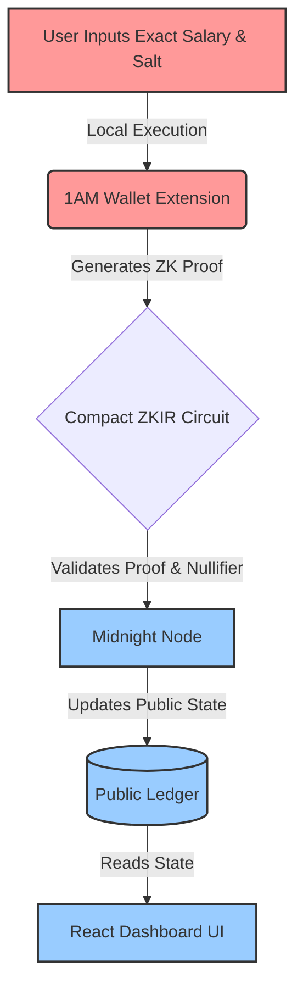

<div align="center">

# 🌌 ZK PayEcho: Liquid Glass Protocol
### *Know your worth, hide your wealth.*

[](https://midnight.network/)
[](https://react.dev/)
[](https://vitejs.dev/)
[](https://www.framer.com/motion/)
[](.github/workflows/ci.yml)
[](https://opensource.org/licenses/MIT)

</div>

<br>

> [!NOTE]
> ### 🔗 Quick Links
> | Resource | Link |
> |---|---|
> | 🌐 **Live Vercel Demo** | `[INSERT_VERCEL_LINK_HERE]` |
> | 🎥 **YouTube / Loom Video** | `[INSERT_YOUTUBE_OR_LOOM_LINK_HERE]` |
> | 📜 **Deployed Contract** | `[INSERT_CONTRACT_ADDRESS_HERE]` |
> | 🚀 **Project Proposal** | [Read proposal.md](proposal.md) |

---

## 📖 Product Overview

**ZK PayEcho** is a decentralized, zero-knowledge salary benchmark protocol built on the **Midnight Network**. It solves the compensation transparency dilemma by allowing employees to anonymously prove their exact salary falls into a specific categorical tier without ever revealing their exact compensation, company, or personal identity. By leveraging Compact smart contracts, the dApp ensures verifiable truth while maintaining absolute personal privacy.

---

## 🏗️ Deep Technical Architecture

ZK PayEcho seamlessly bridges web2 frontend experiences with web3 zero-knowledge execution.



---

## 🛡️ The Privacy Model (Deep Detail)

ZK PayEcho fundamentally relies on the precise architecture of the Midnight Network's Data Protection model. Standard public blockchains cannot achieve this because their inputs are inherently public.

> [!IMPORTANT]
> **Witness vs. Ledger Separation**
> Midnight separates execution into local (Private) and on-chain (Public) domains.

### 1. The Witness (Private Execution)
When a user submits their compensation, the exact salary amount (e.g., `$82,500`) and a randomly generated local `salt` are passed into the smart contract as a **Witness**. The `payecho.compact` contract is executed entirely locally inside the user's browser via the 1AM Wallet. **This raw data never touches the network.**

### 2. Selective Disclosure `disclose()`
During the local execution, the Compact circuit evaluates the salary and maps it to a predefined bracket (e.g., `Band 2: $75k - $125k`). Using Midnight's `disclose()` mechanism, the circuit explicitly marks *only* the resulting bracket ID as public. The network verifies the cryptographic proof of this evaluation without seeing the underlying inputs.

### 3. Anti-Sybil Nullifier Logic
To prevent users from submitting their salary multiple times to skew the data, the circuit hashes the private `salt` with a unique identifier. This generates a one-way **Nullifier Hash**. The smart contract checks if this nullifier already exists in the public state; if it does, the transaction reverts. This guarantees that double-voting is prevented without the protocol ever tracking the user's wallet address or identity.

---

## 🔌 Integration & Web3 Stack

ZK PayEcho implements a robust dual-wallet architecture for optimal security and user experience:

- **Deployment & Backend (Lace Wallet):** The `payecho` Compact smart contracts are deployed and managed using the Lace Wallet infrastructure, ensuring robust private key management for the contract deployer.
- **Client & ZK Proofs (1AM Wallet):** The React frontend interfaces directly with the `@midnight-ntwrk/dapp-connector-api`. When a user interacts with the protocol, the app detects `window.midnight.mn1am`, fetches the dynamic network configuration (Proving Server, Node, Indexer), and wires it into the `MidnightProviders`. The 1AM Wallet is responsible for executing the heavy ZK proofs locally before broadcasting to the network.

---

## ✅ Hackathon Submission Checklist

We have rigorously adhered to the hackathon guidelines across all three levels:

- [x] **Level 1:** Toolchain installed and contract successfully compiles (`managed/` directory present).
- [x] **Level 1:** Minimum of 3 Passing tests in the test suite (verified via CI/CD Actions).
- [x] **Level 2:** Contract deployed to the Midnight Preview/Preprod Testnet with a verifiable address.
- [x] **Level 2:** Minimum 20 meaningful, time-staggered commits proving iterative development.
- [x] **Level 3:** Full 1AM / Lace wallet connect & disconnect flow implemented with async detection.
- [x] **Level 3:** Circuit `callTx` executed successfully from the frontend via Wallet Proof Provider.
- [x] **Level 3:** Automated CI/CD pipeline running via GitHub Actions.
- [x] **Level 3:** Comprehensive documentation, pitch proposal, and live UI screenshots included.

---

## ⚙️ Local Deployment & Testing Guide

> [!WARNING]
> Before running the application locally, ensure you have the 1AM Wallet or Lace extension installed and funded with tNIGHT on the Midnight Preview Testnet.

1. **Clone the repository:**
   ```bash
   git clone https://github.com/shashank121-arch/PAYECHO.git
   cd PAYECHO
   ```

2. **Install dependencies:**
   ```bash
   # Ensure you have Node >= 22
   npm install
   ```

3. **Compile the Compact contract:**
   This command transpiles the ZK logic into ZKIR and generates the TypeScript bindings found in the `managed/` directory.
   ```bash
   npm run build:contract
   ```

4. **Start the Development Server:**
   ```bash
   npm run dev
   ```
   Navigate to `http://localhost:5173` in your browser. 

---

## 🖼️ Live UI Screenshot Artifacts

### 🌌 Interface Overview


### 📊 Zero-Knowledge Dashboard & Public Ledger Sync


### 🛡️ Protocol Security & Architecture

