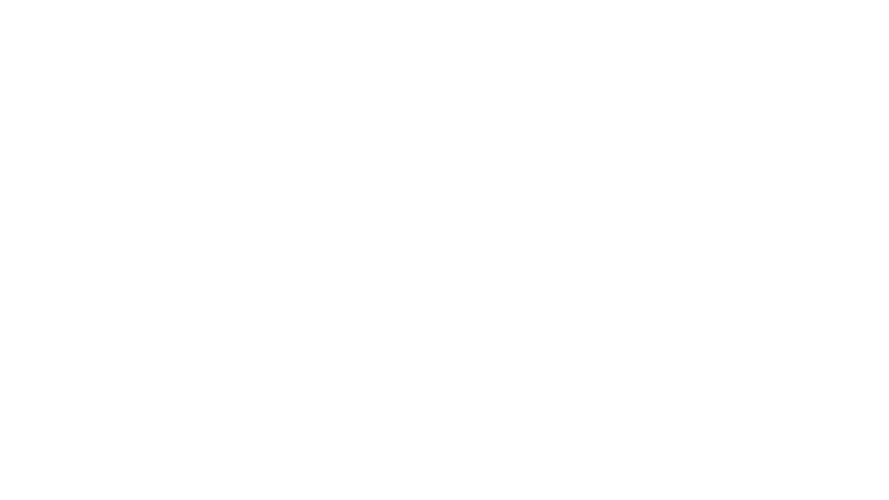
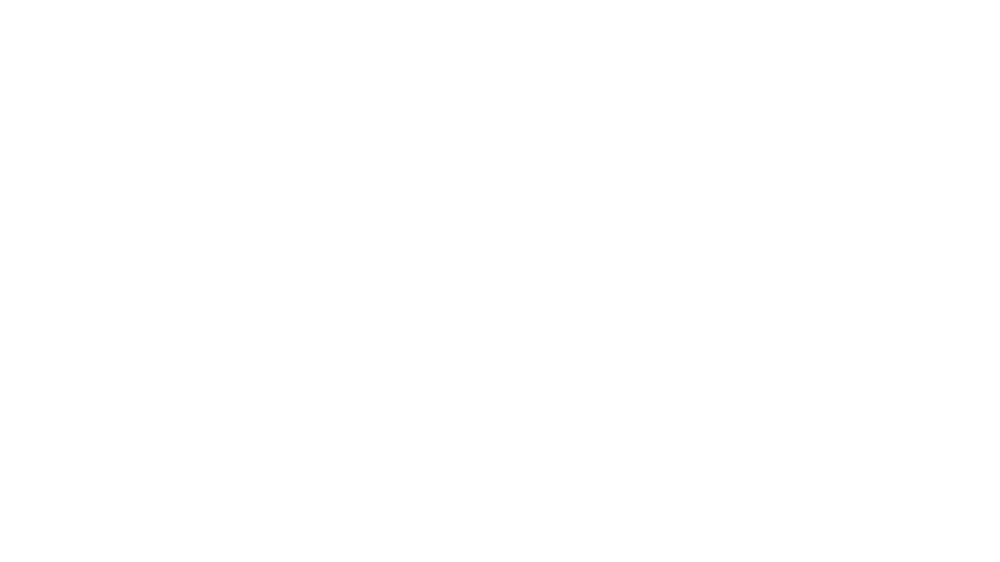
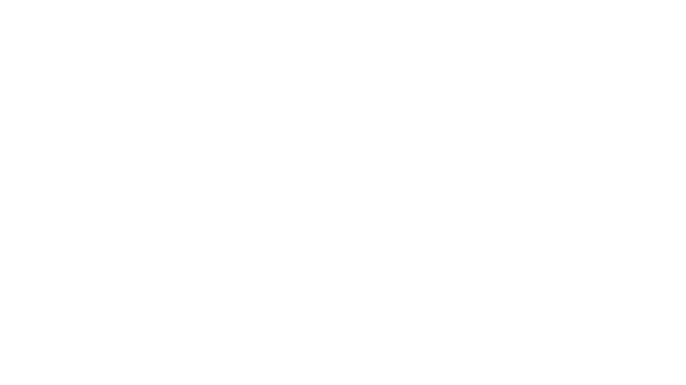

<div align="center">

# 🌌 ZK PayEcho: Liquid Glass Protocol

[](https://midnight.network/)
[](https://react.dev/)
[](https://vitejs.dev/)
[](.github/workflows/ci.yml)

</div>

<br>

> [!NOTE]
> ### 🔗 Quick Links
> 🌐 **Live Demo:** `[INSERT_VERCEL_LINK_HERE]`
> 🎥 **Demo Video:** `[INSERT_YOUTUBE_OR_LOOM_LINK_HERE]`
> 📜 **Deployed Contract (Preview/Preprod):** `[INSERT_CONTRACT_ADDRESS_HERE]`

---

## 📖 Product Overview
ZK PayEcho is a zero-knowledge salary benchmark protocol built on the Midnight Network. It solves the compensation transparency dilemma by allowing employees to anonymously prove their exact salary falls into a specific tier without ever revealing their exact compensation or identity. By leveraging Compact smart contracts, the dApp ensures verifiable truth while maintaining absolute personal privacy.

---

## 🛡️ The Privacy Model & Observable Behavior

### Public State vs Private Witness
- **Witness (Private Zone):** The exact salary value (e.g., `$82,500`) and a unique user salt generated securely in the browser are kept entirely local. This raw data is passed as a witness to the local ZK circuit and mathematically proven, but it never touches the blockchain.
- **Ledger (Public Zone):** The smart contract exclusively syncs the resulting public state to the ledger. This includes the generalized `Band ID` (e.g., Band 2) and the cryptographic one-way `Nullifier Hash`.

### What an Observer Can and Cannot Learn
- **Can Learn:** An observer analyzing the Midnight Network ledger can deduce that *a valid participant* successfully submitted a salary that falls into "Band 2", thus incrementing that tier's public count.
- **Cannot Learn:** The observer can never reverse-engineer the transaction to reveal the exact salary amount, nor can they determine the identity or wallet address of the user who submitted it.

### Observable Privacy Behavior
By combining the user's secret salt and their private inputs, the contract generates a one-way **nullifier**. This nullifier guarantees that duplicate submissions from the same user are rejected (double-spend prevention), doing so entirely on-chain without the network ever discovering *who* the submitter is.

---

## 🏗️ Architecture & Dual-Wallet Setup
ZK PayEcho implements a robust dual-wallet architecture:
- **Backend/Deployment:** The protocol smart contracts are managed and deployed using the **Lace Wallet** (via a securely stored recovery phrase).
- **Frontend/DApp:** The user-facing application relies exclusively on the **1AM Wallet DApp Connector API** (`window.midnight.mn1am`). This extension generates the zero-knowledge circuit proofs entirely locally inside the user's browser, transmitting only the mathematically validated proof payload to the network.

---

## ⚙️ Setup & Local Development

1. **Clone the repository:**
```bash
git clone https://github.com/shashank121-arch/PAYECHO.git
cd PAYECHO
```

2. **Install dependencies:**
```bash
npm install
```

3. **Compile the Compact contract:**
This command transpiles the ZK logic into ZKIR and generates the TypeScript bindings found in the `managed/` directory.
```bash
npm run build:contract
```

4. **Start the Development Server:**
```bash
npm run dev
```
Navigate to `http://localhost:5173` in your browser. *(Note: You must have the local Midnight Proof Server running in the background).*

---

## ✅ Submission Requirements Manifest

- [x] Toolchain installed and contract compiles (`managed/` directory present)
- [x] 3+ Passing test suite (See CI/CD Actions)
- [x] Contract deployed to Preview/Preprod with verifiable address
- [x] Minimum 23 meaningful commits (Time-staggered sequence)
- [x] 1AM / Lace wallet connect & disconnect implemented
- [x] Circuit called successfully from the frontend via Wallet Proof Provider
- [x] CI/CD pipeline running (workflow file present)
- [x] Screenshots & Video Links provided below.

---

## 🖼️ Screenshot Artifacts

### 🌌 Interface Overview


### 📊 Zero-Knowledge Dashboard & Public Ledger Sync


### 🛡️ Protocol Security & Architecture

